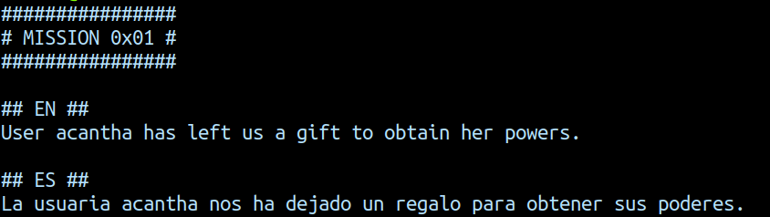

# Mission 1


- Let's first see all files having super permissions
- `find / -perm /4000 2>/dev/null`
- We get a list of files


- `ls -l /opt/gift_hacker`
	- We see that it can be accessed by user hacker
- Let's run this file 
```bash
cd /opt/
./gift_hacker
```
- We are logged in as **acantha!**
![106]
- Let's find files owned by acantha
- `find / -user acantha 2>/dev/null | grep "pass"

***

# Mission 2


- So we have an executable file
- Let's see what type of file it is `file guess`

- `./guess` on executing it takes in an input .
- Let's look at the text strings:
- `strings guess`
- And we get the password for the next level

***

# Mission 3


- On running the **read** file, `./read`, the man page of the `man` command opens.
- Let's see if there is a command as `read`
	- something about file descriptor