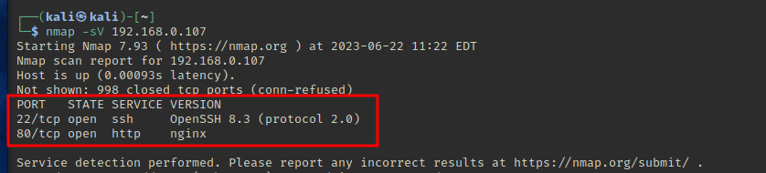
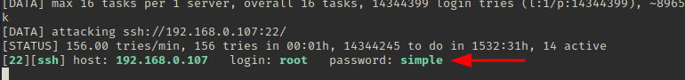
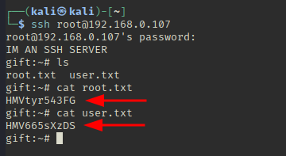

# Gift (Easy)
- Let's start of by running a network scan using nmap.
- `nmap -sV 192.168.0.107`

	- `-sV` : *Probe open ports to determine service/version info*
- We can find 2 ports open
	

- Now let's start of the ssh port

- To find out the password we have to bruteforce, for this we can **hydra**.

- `hydra -l root -P /usr/share/wordlists/rockyou.txt 192.168.0.107 ssh`
	- `-l` : login name
	- `-P` : mention the file that contains the possible passwords.
- We obtain the password

- Now let's ssh into the machine
- `ssh root@192.168.0.107`
	- `ssh [username]@[address]`
- When prompted enter the password we got from hydra and we are in.
