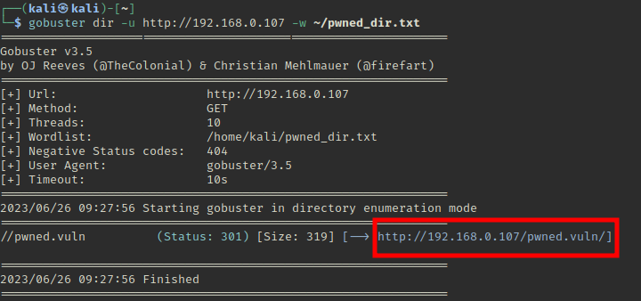

# Pwned 

- First let's start off by doing a nmap scan to check the open ports.
- `nmap -sV -oA /home/kali/Pwned_scan.txt 192.168.0.1/24`

	- `-sV` : User to get the service/version infor of the open ports
	- `-oA` : Outputs the nmap scan results in the given file location

- So 3 ports are open, let's find what is there on port 80.

### Port 80 
 
- And when we view the source of the page we find a comment

- Now let's see if there are any other hidden directories we can access using **gobuster** 

- `gobuster dir -u http://192.168.0.107 -w /usr/share/wordlists/dirbuster/directory-list-1.0.txt`
	- we find `/nothing`

- Let's try another wordlist
- `gobuster dir -u http://192.168.0.107 -w /usr/share/wordlists/dirbuster/directory-list-2.3-medium.txt`
	- we find `/hidden_text`
- where we find a list of directories 

- Let's store this in a file and use this as our wordlist.
- `curl http://192.168.0.107/hidden_text/secret.dic > ~/pwned_dir.txt`
- Using this wordlit in gobuster
- `gobuster dir -u http://192.168.0.107 -w ~/pwned_dir.txt`

- Let's navigate to `http://192.168.0.107/pwned.vuln/` in our browser, we can find a login page. On viewing the source code we get the password. 

- This should be the credentials for the ftp server

### Port 21 - FTP

- Login to the FTP server `ftp ftpuser@192.168.0.107` and when prompted enter the password we obtained from the source code.
- If we `ls` we can find a `share` directory.

- We can download the files to out local machine using the `get` followed by the file name.

- We even find a `id_rsa` file which is the private key for ssh, which let's us login without entering the password.

- To ssh using the private key, we have to set the right file permissions `chmod 600 id_rsa`
- `ssh ariana@192.168.0.107 -i id_rsa`

- **We will get the user flag!**

- Okay, now let's see if there is any other user. `cd /home`

- Let's see the messenger.sh `cat messenger.sh`
- This script takes in input and the message that we provide, it executes the message. We need to take advantage of it.

- Let's check the sudo permissions for user `ariana` : `sudo -l`

- ariana can execute the script as selena without requiring to enter the password.

- Executing the script as `selena` `sudo -u selena ./messenger.sh`

- Now let's open a shell using this as selena.

- We have access to selena now, let's run the `id`  command to get more information of `selena`

- Docker creates new containers as a root user. The docker group grants root-level privileges to the user 

- We have to abuse this now to get the root flag.
- Let's make use of GTFObins, break the shell.

**DONE!**