## Mission 11

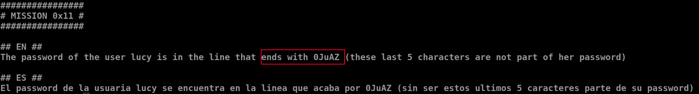
- `cat end | grep -i "0JuAZ$"`
	- `grep` is used to find strings in a text file
	- `-i` is used to match strings irrespective of the case(lower or upper)
	- `$` is used to denote the end of the string

***
## Mission 12

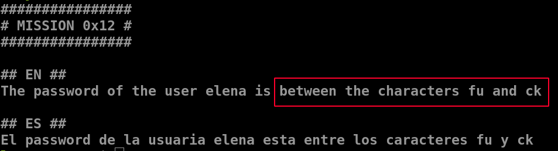
- `cat file.yo | grep "^fu.*ck$"`
	- `grep` is used to find strings in a text file
	- `$` is used to denote the end of the string
	- `^` used to denote the start of the string
	- `.*` denotes an arbitrary string of arbitrary length

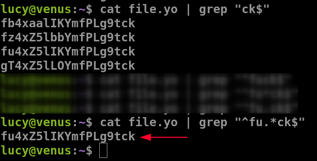

***

## Mission 13

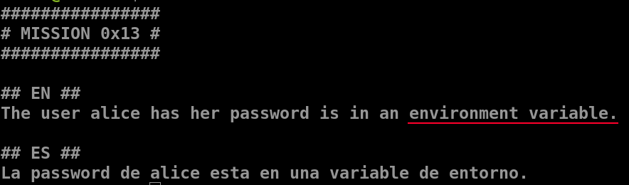
- `env`

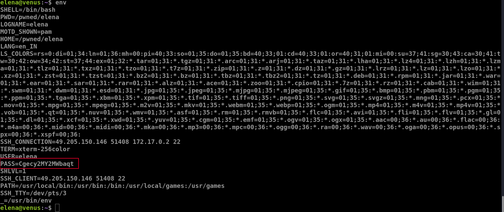
***

## Mission 14

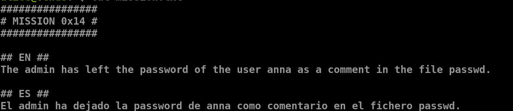
- it is mostly the `/etc/passwd`
- `cat /etc/passwd | grep "alice"`

***

## Mission 15

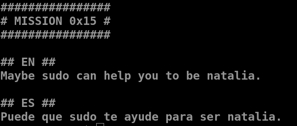
- let's try `sudo -l`
	- it lists the allowed commands for that particular user

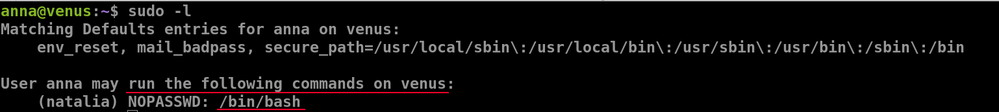
- using `sudo -u natalia /bin/bash`
	- this runs the command as the specified user
	- from the above we know that it has access to the `/bin/bash` file
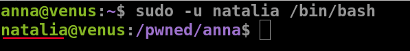
- we get the password for natalia

***

## Mission 16

- `base64 -d base64.txt`
	- `base64`
	- `-d` to decode the text
	- followed by the file name

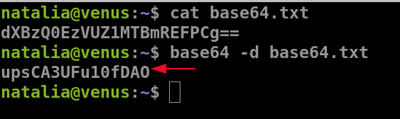
***

## Mission 17

- `find / -type f -mtime +18980 2>/dev/null`
	- `-mtime` it is a file property confirming the last time the file was modified
	- `(2022-1970) * 365 = 18980`
	- the `+` indicates older than 1970

***

## Mission 18

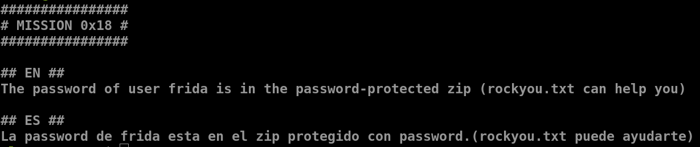

- run this on you local machine ([about scp](https://linuxize.com/post/how-to-use-scp-command-to-securely-transfer-files/))
	- `scp -P 5000 clara@venus.hackmyvm.eu:~/protected.zip ~/` 
	- this is used to securely copy files from the remote location to your local desktop
	- `-P` mentions the ssh port
	- SYNTAX : `scp [OPTION] [user@]SRC_HOST:]file1 [user@]DEST_HOST:]file2`

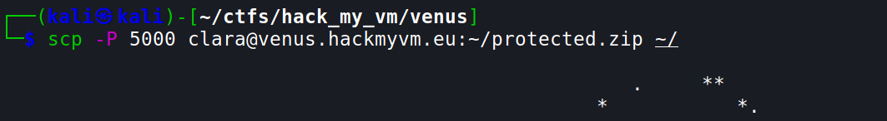
. . . .

- `zip2john protected.zip > pass`
- we are getting the hashed form of the password

- `john pass --wordlist=/usr/share/wordlists/rockyou.txt`
- after executing this command we get the password for the protected zip file

- now we have to get the password for frida
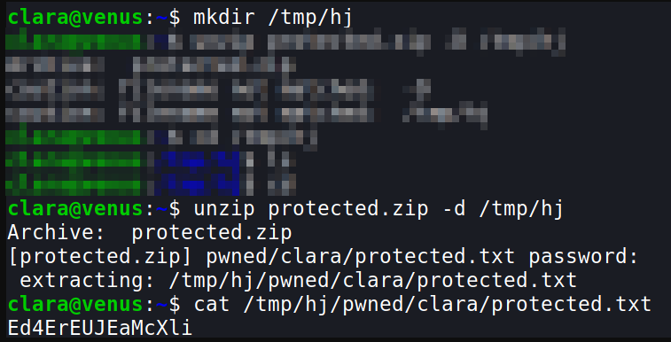
***

## Mission 19

- we can use the commadn `uniq`
	- `uniq -d repeated.txt`
	- uniq is used to filter adjacent matching lines
	- `-d` is used to print only repeated lines

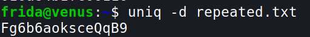

***

## Mission 20
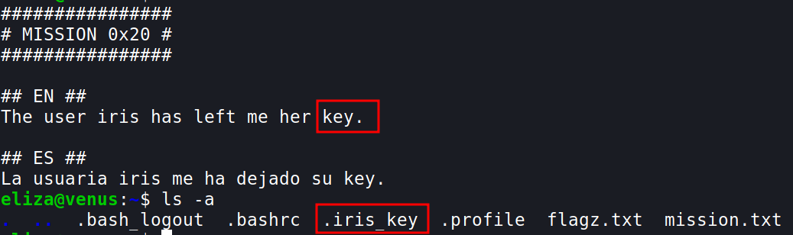

- I'm not sure why the first one did not work
- `ssh -i .iris_key iris@localhost`
	- here localhost denotes computers IP and the port it is using, since we are already logged into venus.hackmyvm.eu I  think it works

- we get the password for `iris`

***