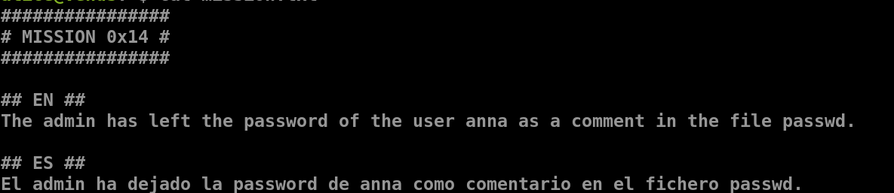
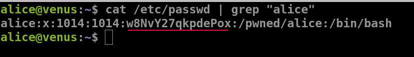
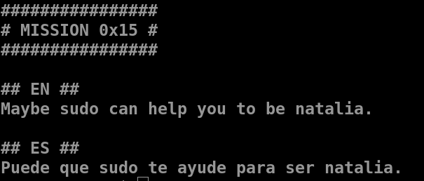
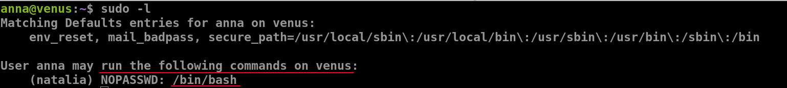
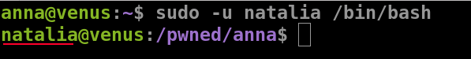
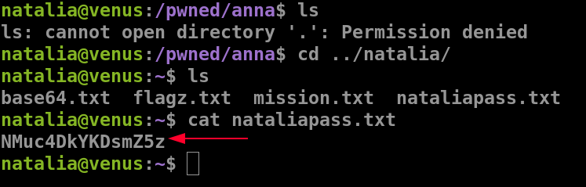
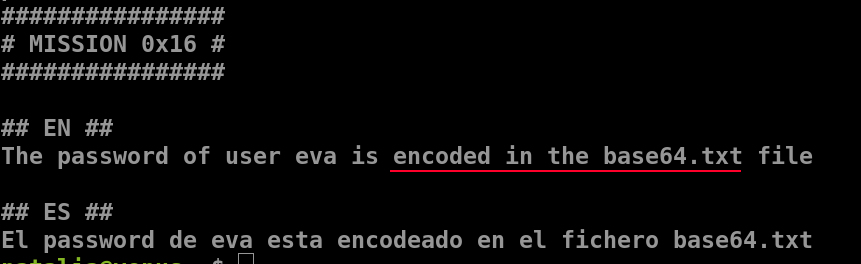
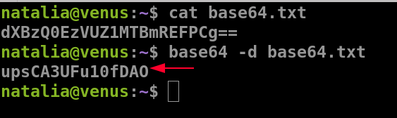

## Mission 14

- it is mostly the `/etc/passwd`
- `cat /etc/passwd | grep "alice"`

***

## Mission 15

- let's try `sudo -l`
	- it lists the allowed commands for that particular user

- using `sudo -u natalia /bin/bash`
	- this runs the command as the specified user
	- from the above we know that it has access to the `/bin/bash` file

- we get the password for natalia

***

## Mission 16

- `base64 -d base64.txt`
	- `base64`
	- `-d` to decode the text
	- followed by the file name

***

