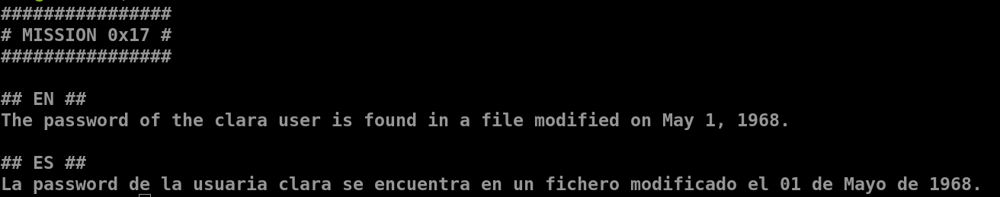
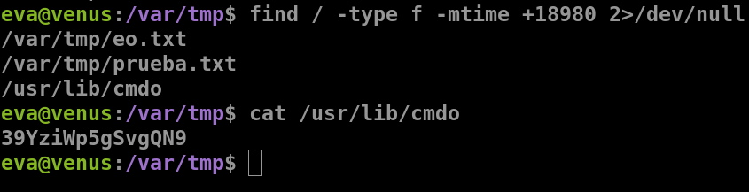
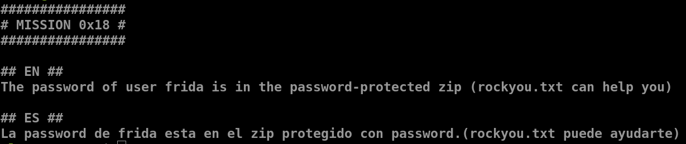
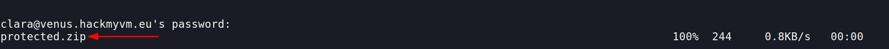
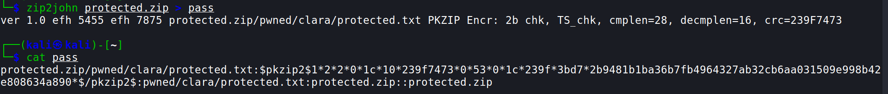
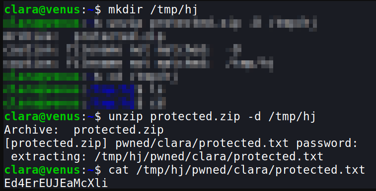
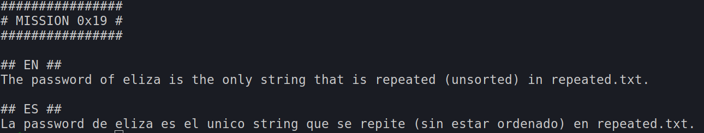
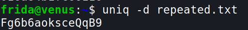

## Mission 17

- `find / -type f -mtime +18980 2>/dev/null`
	- `-mtime` it is a file property confirming the last time the file was modified
	- `(2022-1970) * 365 = 18980`
	- the `+` indicates older than 1970

***

## Mission 18

- run this on you local machine ([about scp](https://linuxize.com/post/how-to-use-scp-command-to-securely-transfer-files/))
	- `scp -P 5000 clara@venus.hackmyvm.eu:~/protected.zip ~/` 
	- this is used to securely copy files from the remote location to your local desktop
	- `-P` mentions the ssh port
	- SYNTAX : `scp [OPTION] [user@]SRC_HOST:]file1 [user@]DEST_HOST:]file2`

. . . .

- `zip2john protected.zip > pass`
- we are getting the hashed form of the password

- `john pass --wordlist=/usr/share/wordlists/rockyou.txt`
- after executing this command we get the password for the protected zip file

- now we have to get the password for frida

***

## Mission 19

- we can use the commadn `uniq`
	- `uniq -d repeated.txt`
	- uniq is used to filter adjacent matching lines
	- `-d` is used to print only repeated lines

***

