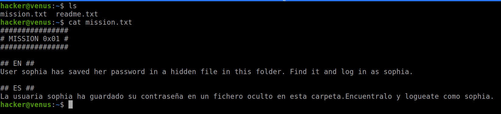
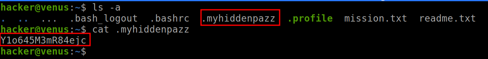
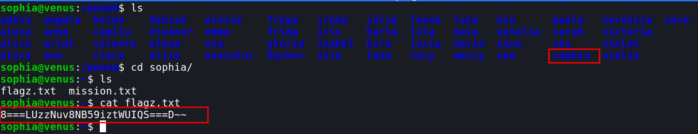
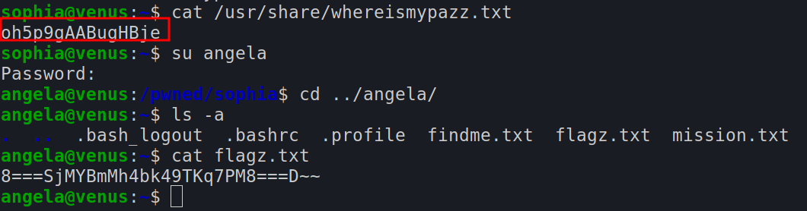
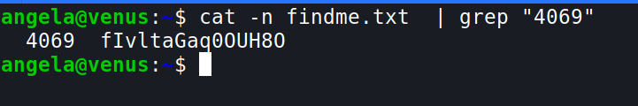

> This can be found [here](https://hackmyvm.eu/venus/)
```
Host: venus.hackmyvm.eu

Port: 5000

User: hacker

Pass: havefun!
```

- let's login using `ssh hacker@venus.hackmyvm.eu -p 5000`
	- description `ssh user@host -p (port number)`


- after logging in:

## Mission 1

- we can use the `ls` command to list the contents of the directory
- `cat` is used the print the file contents as output
- so the password is saved in a hidden file
- let's try `ls -a` 
	- the `-a` is used to list hidden files (read more about it using `man ls`)

- We get the password for the next level!!
- Now we have to login as sophia using the obtained password
- we can use `su sophia`
	- `su` is used to switch user or run a command  with substitute user
	- so here we are switching the user to sophia
- when we try `ls` we get a permission denied message
- now let's go back a directory `cd ..` and ls
- we can find many users, let's go to sophia

- here we can find the flag and the next mission!

***

## Mission 2

- For this mission we have to find a file called `whereismypazz.txt` 
- we can use a command `find`
- `find / -name whereismypazz.txt -type f 2>/dev/null`
	- here `/` tells to find form the root directory
	- `-name` flag is used to specify name
	- `-type f` us used to specify the type of files here `-f` mentions files, `-d` is used for directories
	- `2>/dev/null` is a file descriptor used to dump all the errors and not diplay them in the output

- now we can log in as angela and proceed to the next mission

*** 

## Mission 3

- The password for emma is stored in line `4069` of the file `findme.txt`
- We can read through each line of the file, but there is a more efficient way to do it
- we can use `cat` and `grep`
- `cat -n findme.txt  | grep "4069"`
	- cat `-n` numbers all the output lines
	- once the lines are numbered, we can `grep` them (check `man grep`)
