## Mission 20
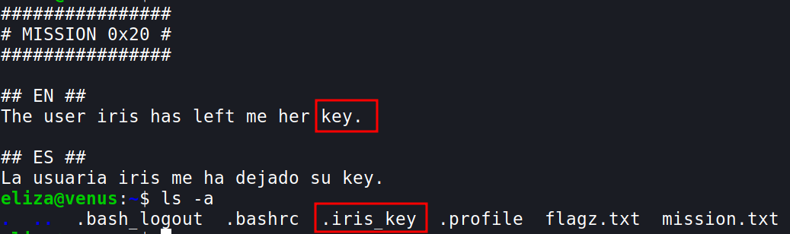
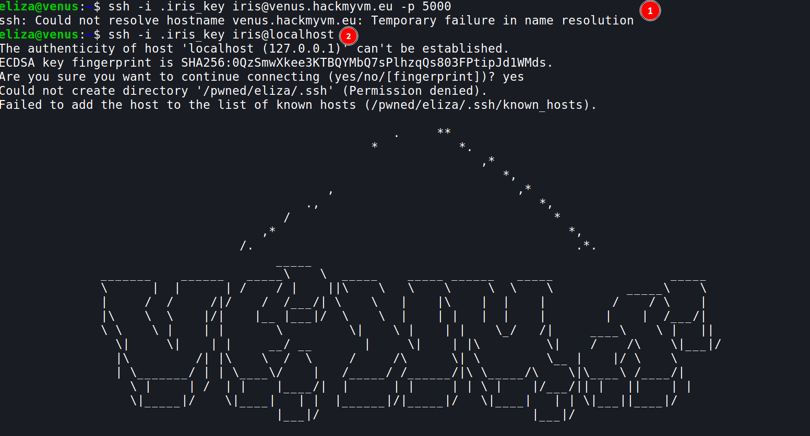
- I'm not sure why the first one did not work
- `ssh -i .iris_key iris@localhost`
	- here localhost denotes computers IP and the port it is using, since we are already logged into venus.hackmyvm.eu I  think it works

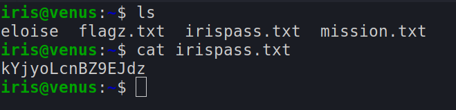
- we get the password for `iris`

***

## Mission 21
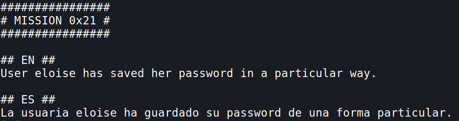
- now let's copy the file to our home directory in our local system
	- `scp -P 5000 iris@venus.hackmyvm.eu:~/eloise ~/`
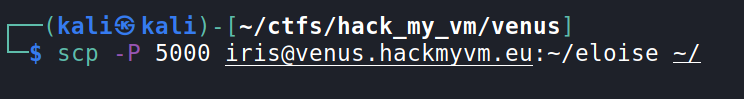

- This looks like base64 encoded
	- `cat eloise`
- Base64 encoded data will always have the following characteristic:
	- The length of a Base64-encoded string is always a multiple of 4
	- Only these characters are used by the encryption: “A” to “Z”, “a” to “z”, “0” to “9”, “+” and “/”
	- The end of a string can be padded up to two times using the “=”-character (this character is allowed in the end only) [reference](https://www.hannesholst.com/blog/how-to-identify-a-base64-encoded-string/#:~:text=The%20length%20of%20a%20Base64,allowed%20in%20the%20end%20only)
- Let's decode it
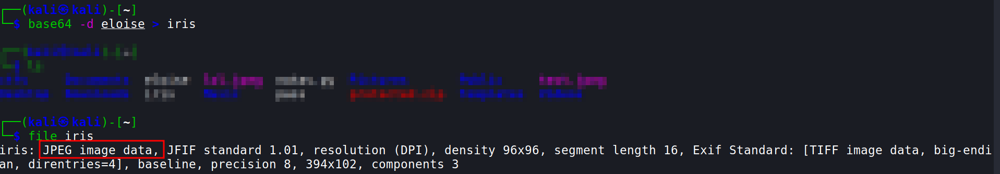
- so it is an image, open that image and you'll find the password for the next level!!

***

## Mission 22

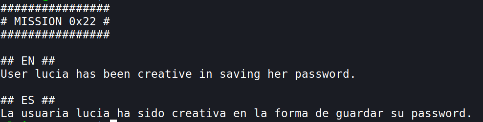
- lets copy the file to out local machine
	- `scp -P 5000 eloise@venus.hackmyvm.eu:~/hi ~/`

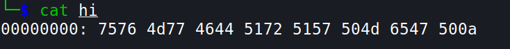
- This is hexadecimal characters
- Now we should revert them back, we can do this using `xxd` (`man xxd`)
	- `xxd -r hi`

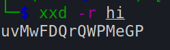

***

## Mission 23
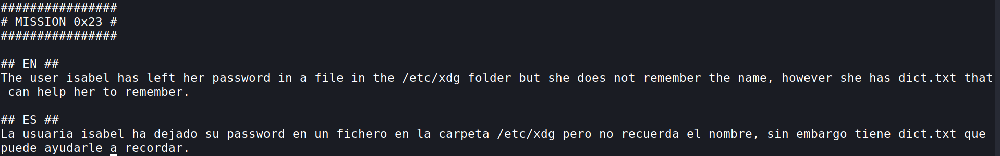
- So in this level we have to try searching all the names in the `dict.txt` file, if it exists in the `/etc/xdg` folder
- `while IFS= read -r line; do find /etc/xdg/$line 2>/dev/null ; done < dict.txt` 
	- Add `IFS=` option before read command to prevent leading/trailing whitespace from being trimmed.
	- The `-r` option passed to read command prevents backslash escapes from being interpreted.
	- then we are passing using the `find` command to search for the file using the variable `line` i.e each line of the `dict.txt` file
	- `2>/dev/null` is used to dump all the error messages and show only the output
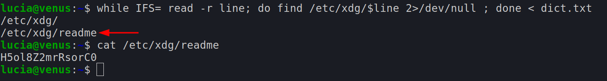
- We get the password for isabel!!

