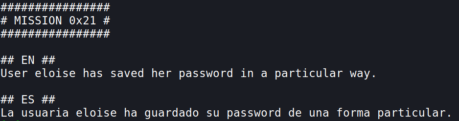
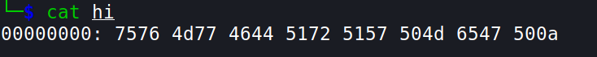
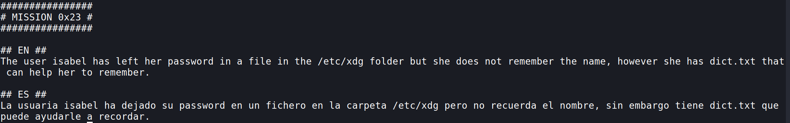
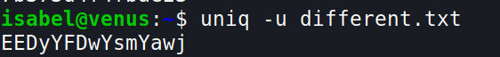
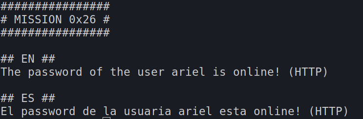
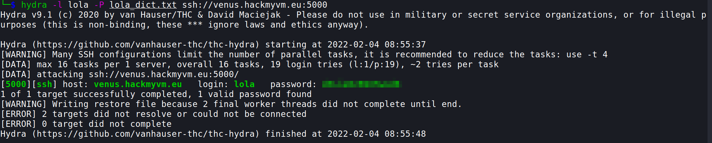
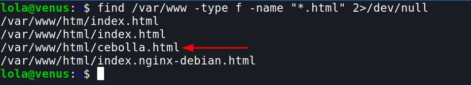
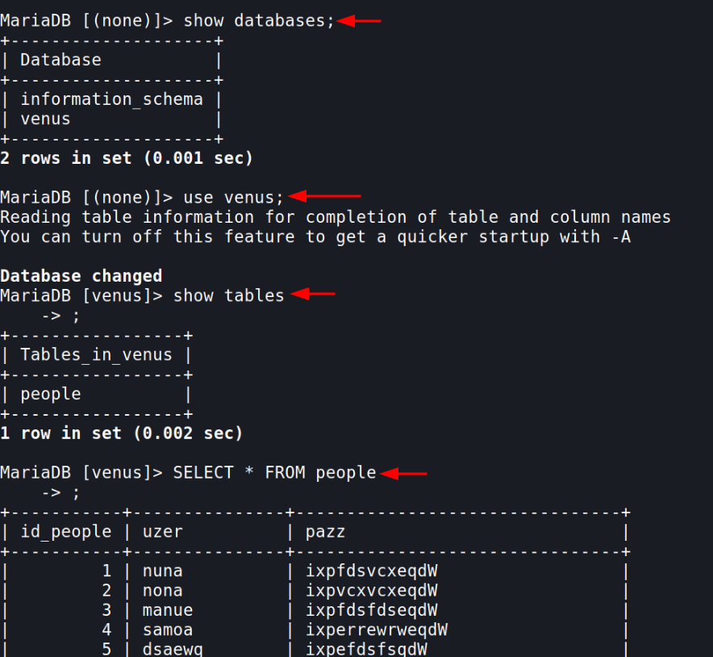

## Mission 21

- now let's copy the file to our home directory in our local system
	- `scp -P 5000 iris@venus.hackmyvm.eu:~/eloise ~/`

- This looks like base64 encoded
	- `cat eloise`
- Base64 encoded data will always have the following characteristic:
	- The length of a Base64-encoded string is always a multiple of 4
	- Only these characters are used by the encryption: “A” to “Z”, “a” to “z”, “0” to “9”, “+” and “/”
	- The end of a string can be padded up to two times using the “=”-character (this character is allowed in the end only) [reference](https://www.hannesholst.com/blog/how-to-identify-a-base64-encoded-string/#:~:text=The%20length%20of%20a%20Base64,allowed%20in%20the%20end%20only)
- Let's decode it

- so it is an image, open that image and you'll find the password for the next level!!

***

## Mission 22

- lets copy the file to out local machine
	- `scp -P 5000 eloise@venus.hackmyvm.eu:~/hi ~/`

- This is hexadecimal characters
- Now we should revert them back, we can do this using `xxd` (`man xxd`)
	- `xxd -r hi`

***

## Mission 23

- So in this level we have to try searching all the names in the `dict.txt` file, if it exists in the `/etc/xdg` folder
- `while IFS= read -r line; do find /etc/xdg/$line 2>/dev/null ; done < dict.txt` 
	- Add `IFS=` option before read command to prevent leading/trailing whitespace from being trimmed.
	- The `-r` option passed to read command prevents backslash escapes from being interpreted.
	- then we are passing using the `find` command to search for the file using the variable `line` i.e each line of the `dict.txt` file
	- `2>/dev/null` is used to dump all the error messages and show only the output

- We get the password for isabel!!

***

## Mission 24

> There is a mistake, the file name is not `repeated.txt` it is **`different.txt`**
- `uniq -u different.txt` 
	- `-u` is used to only print unique lines

*** 

## Mission 25

- For this we can use `crontabs` [read more](https://linux.die.net/man/5/crontab); [cron sceduler](https://crontab.guru/#*_*_*_*)
- let us create a cron job that copies all the files of the `/free` directory 
- let's create a direcory `mkdir /tmp/hj` and let's just add a file - `touch test`
- now open crontab using `crontab -e`
	- and add this `i`
		- what this does is it copies all the contents of `/free` and puts it to `/tmp/hj`, every minute

***

## Mission 26

- `curl localhost`

***

## Mission 27
  
- we have a `.swp` file [read more](https://fileinfo.com/extension/swp#:~:text=An%20SWP%20file%20is%20a,to%20the%20currently%2Dopen%20file.), let's open it using `vi .goas.swp` after opening it, press colon `:recover`, we get this, hit enter.
  
  
- now we have to brute force into lola's account using these passwords, so let's make this file a suitable wordlist,
	- go to the start of the file using `gg` and delete the first line using `dd`
	- now go down using the `j` key, and delete the `-->` using `dw`, go to the start of the next line and pres `.`, this repeates the previous step, i.e `dw` deletes the `-->`
	- now go down using `j` and press `.`, repeat these for all lines
	- now let's save this, since we don't have permission to save it in home directory we can save in the `/tmp` directory
	- `:w /tmp/lola_dict.txt` - saves the file in /tmp

- Now to brute force the password, we can use `hydra`, let's copy the dict file to our local machine
	- `scp -P 5000 ariel@venus.hackmyvm.eu:/tmp/lola_dict.txt ~/`
- `hydra -l lola -P lola_dict.txt ssh://venus.hackmyvm.eu:5000`
	- `-l` user
	- `-P` password file
	- `[service://server[:PORT][/OPT]]`

***

## Mission 28

- we can do this by navigating to the `/var/www/html` directory

**OR**

***
## Mission 29

- login to mysql `mysql -p`

- we can find the user `nina` who also exists on the venus machine, so let's take her password!
***

# Mission 30

- User kira seems to be hiding something in a **php** file.
- let's curl the url `http://localhost/method.php`
- it returns a `iI dont like this method!`
  
  - hmmm... so we have to find another method to access this file.

- For http, there are different methods:
  - POST
  - GET
  - PUT
  - DELETE
- By default the curl uses the `GET` method
- We can try the `PUT` method, as `PUT` method is **idempotent**,i.e, the for a single request it provides the same effect on the server as the effect of making several identical requests.
- For those who are curious, `POST` method won't work, as `POST` method is **not idempotent**, i.e, each request will have a different effect on the server.
- `curl -X PUT http://localhost/method.php`

***

