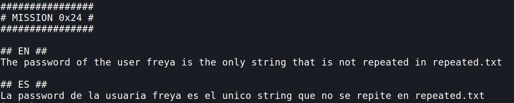
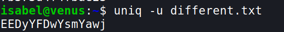
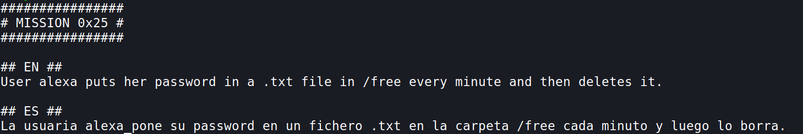
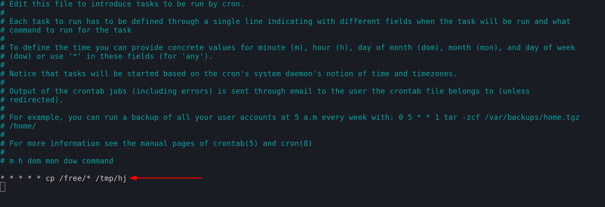

## Mission 24

> There is a mistake, the file name is not `repeated.txt` it is **`different.txt`**
- `uniq -u different.txt` 
	- `-u` is used to only print unique lines

*** 

## Mission 25

- For this we can use `crontabs` [read more](https://linux.die.net/man/5/crontab); [cron sceduler](https://crontab.guru/#*_*_*_*)
- let us create a cron job that copies all the files of the `/free` directory 
- let's create a direcory `mkdir /tmp/hj` and let's just add a file - `touch test`
- now open crontab using `crontab -e`
	- and add this `i`
		- what this does is it copies all the contents of `/free` and puts it to `/tmp/hj`, every minute

