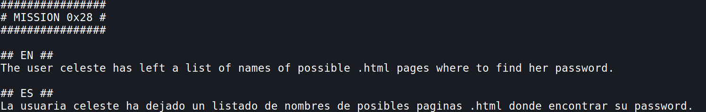

## Mission 26

- `curl localhost`

***

## Mission 27
  
- we have a `.swp` file [read more](https://fileinfo.com/extension/swp#:~:text=An%20SWP%20file%20is%20a,to%20the%20currently%2Dopen%20file.), let's open it using `vi .goas.swp` after opening it, press colon `:recover`, we get this, hit enter.
  
  
- now we have to brute force into lola's account using these passwords, so let's make this file a suitable wordlist,
	- go to the start of the file using `gg` and delete the first line using `dd`
	- now go down using the `j` key, and delete the `-->` using `dw`, go to the start of the next line and pres `.`, this repeates the previous step, i.e `dw` deletes the `-->`
	- now go down using `j` and press `.`, repeat these for all lines
	- now let's save this, since we don't have permission to save it in home directory we can save in the `/tmp` directory
	- `:w /tmp/lola_dict.txt` - saves the file in /tmp

- Now to brute force the password, we can use `hydra`, let's copy the dict file to our local machine
	- `scp -P 5000 ariel@venus.hackmyvm.eu:/tmp/lola_dict.txt ~/`
- `hydra -l lola -P lola_dict.txt ssh://venus.hackmyvm.eu:5000`
	- `-l` user
	- `-P` password file
	- `[service://server[:PORT][/OPT]]`

***

## Mission 28

- we can do this by navigating to the `/var/www/html` directory

**OR**

***
## Mission 29

- login to mysql `mysql -p`

- we can find the user `nina` who also exists on the venus machine, so let's take her password!
***