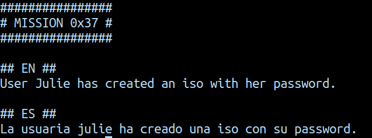
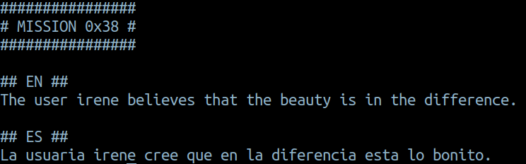
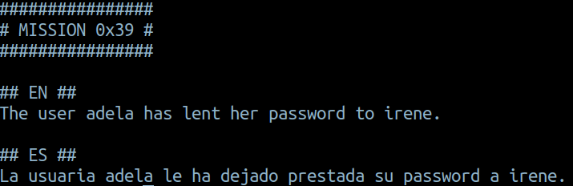
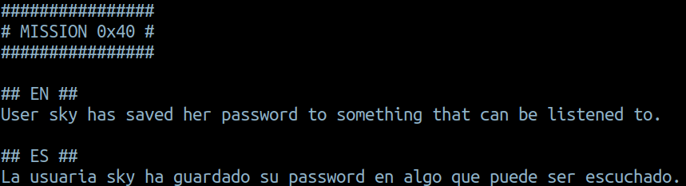

# Mission 31


- Let's get the data on `waiting.php`

- Ok, so we have to use the `user-agent` header for this mission.
- `curl  http://localhost/waiting.php -H "user-agent: PARADISE"`
    - `-H` is used to set header value


***

# Mission 32


- `aliases` are used to store a particular commmand.
- **creating an alias**
    - `alias alias_name="command_to_run"`
- to view the aliases, all we have to do is type `alias` in the cmd


***

# Mission 33


- Ok, so we have to extract the compressed file

- `1` : it is a tar archive
- `2` : since we don't have permission to create files in the home directory we create one in the `/tmp` dir
- `3` : extraction `tar -xf zip.gz --directory /tmp/mission_33`
  - `x` tell the tar to **extract**
  - `f` specifies the file
- now let's go to the dir in `/tmp` and we find the password 

***
# Mission 34


- If we cat the file we find all gibberish, nothing makes sense to us
- We can use `strings` to find the strings in the file
- `strings trash` we can find the pass for the next mission ( we have to remove the first 2 letters)

***

# Mission 35


- Ok so we have to find the last 2 letters of the password, by bruteforcing using hydra
- For coming up with a wordlist for bruteforcing ssh, we can write a python script
```python
import string
# storing the given password
known_pass = "v7xUVE2e5bjUc"

# stored all the lowercase letters
letters = string.ascii_lowercase

# used to generate the wordlist
for letter_1 in letters:
    for letter_2 in letters:
        new_pass = known_pass + letter_1 + letter_2
        print(new_pass)
```

- let's run the code and store the output in a wordlist
`python3 mission_35_wordlist.py > wordlist_35.txt`
    - we are storing the output to `wordlist_35.txt`
- now we can use hydra to bruteforce
- `hydra -l gloria -P wordlist_35.txt venus.hackmyvm.eu -s 5000 -t 4 ssh`
    - `l` takes a single user parameter
    - `P` takes the password wordlist
    - `s` takes the port number
    - `t` specifies the number of threads, 4 is recommended
- it might take a while

***

# Mission 36


- `cat image` gives us a qr code, when i tried scanning it through my mobile, the qr was not getting recognized due to the `#` symbols
- Now let's try changing those `#` symbols into blocks so that the qr can be scanned
- First copy the qr and paste in on your local system and save the file
``` python
# Opening the file we saved which has the qr code, we use r to denote we are opening the file to read
with open('[path_of_the_file]', 'r') as qr:
    lines = qr.readlines()
# we are reading line by line and replacing all the '#' symbols with a block google what (0x2588) is
for l in lines:
    print(l.replace('#', chr(0x2588)), end='')

```
- once we run this program we get a qr code which can be scanned by the phone, and we get the password for the next mission.

***

# Mission 37


- Let's try `strings music.iso`
- And we get the password for the next level

***

# Mission 38



- We can use the `diff` command
- it is used compare files line by line.
`diff 1.txt 2.txt`
- we get the password for the next mission

***

# Mission 39



- We have the private key `id_rsa.pem` , public key `id_rsa.pub`, and the encrypted file `pass.enc`
- `openssl rsautl  -decrypt -inkey id_rsa.pem -in pass.enc `
    - We us `openssl` to decrypt the files
    - `rsautl` for encrypt and decrypt files with RSA keys
    - `decrypt`
- we get the password for the next mission

***

# Mission 40


- `cat wtf`
- this seems like `morse code`
- we can decode this using an online morse decoder

***