# Mission 41

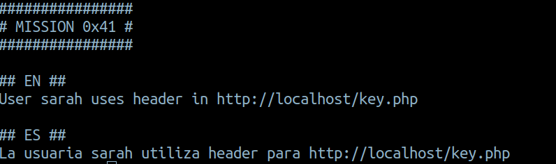
- If we curl that page we get:
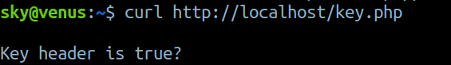
- We have to set the `key` header to `true` to get the password for the next mission.
- `curl -H "key:true" http://localhost/key.php`

***

# Mission 42

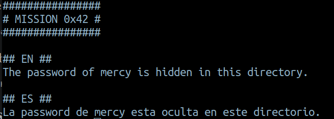
- `ls -a` and we can get the password 
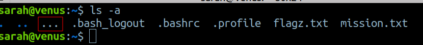

***

# Mission 43

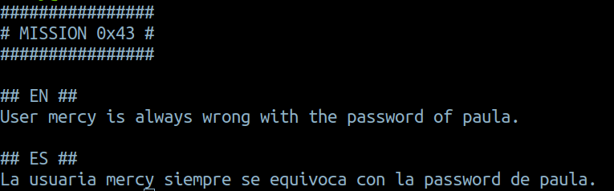
- this  user is always wrong with paula's password...hmmm...so mercy knows paula's password, and she would have entered it previously
- To check the previous commands used by a user, we can view the `.bash_history` or type `history` in the cmd
- And we can get the password for paula

***

# Mission 44

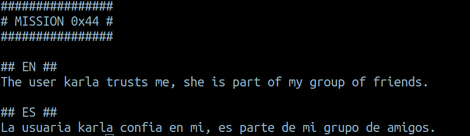
- It gives us a hint about groups, we can create a group and provide specific permission to that particular group
- We can view the group by using `id` command

- Now let's find all the files under the group `hidden`
- `find / -type f -group hidden 2>/dev/null`
  - `find` used to find files 
  - `/` we tell the command to start searching from the root directory
  - `type` search for a files
  - `group` search for a particular group
  - `2>/dev/null` we redirect all the errors to the /dev/null **2** is stderr in linux
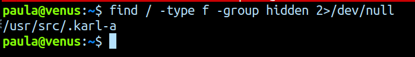

***

# Mission 45

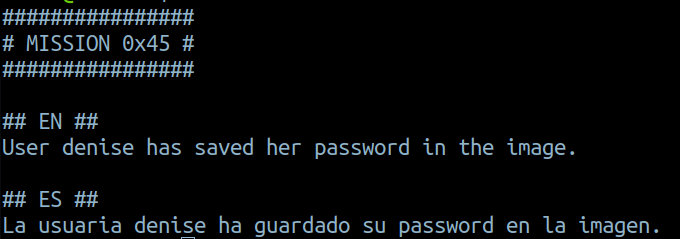
- So this is some type of steganography, i.e hiding messages in images
- Let's first start reading the meta data of this image
- `exiftool yuju.jpg`
- If we see the output carefully, we get tha password for the next mission.

*** 

# Mission 46

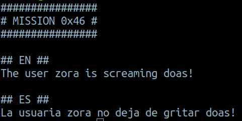
- `doas` is used to execute commands as another user
- Let's try accessing zora using this
- `doas -u zora bash`

***

# Mission 47

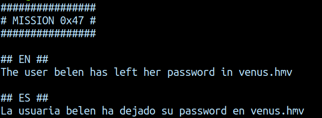
- Ok, so let's find this file
- `find / -type f 2>/dev/null | grep "venus"`
- the password we get here is not the password
- We have to add a header to get the password
- `curl -H "HOST:venus.hmv" http://localhost/` 

***

# Mission 48

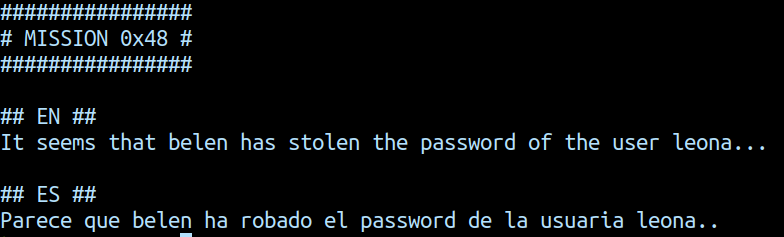
- This seems like a hash of a password from the `$1$`
- After a bit of googling, this seems to be a `MD5` hash
- `john