## Mission 4

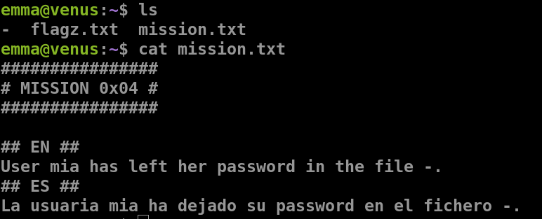

- `cat ./-`

***

# Mission 5

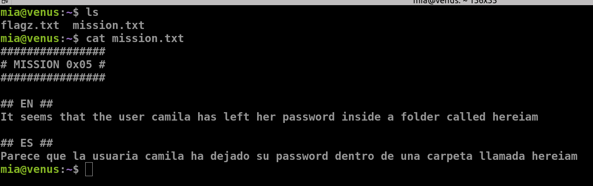

- `find / -name hereiam -type d 2>/dev/null`
	
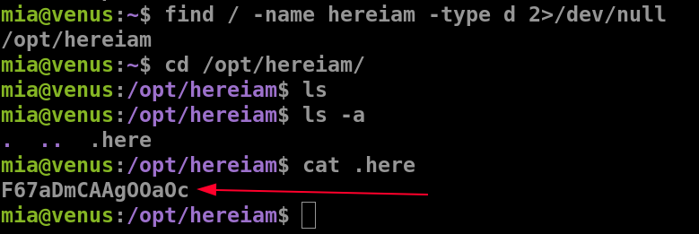

***
## Mission 6

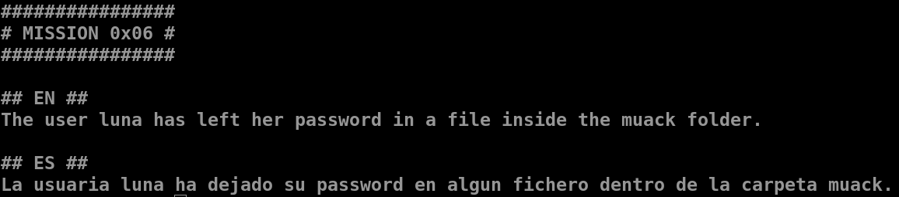 
- `find . -type f`

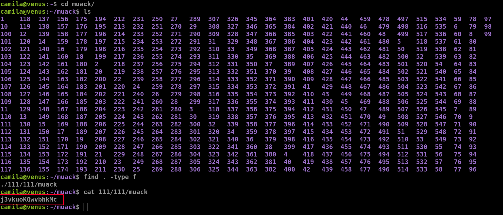

***
## Mission 7

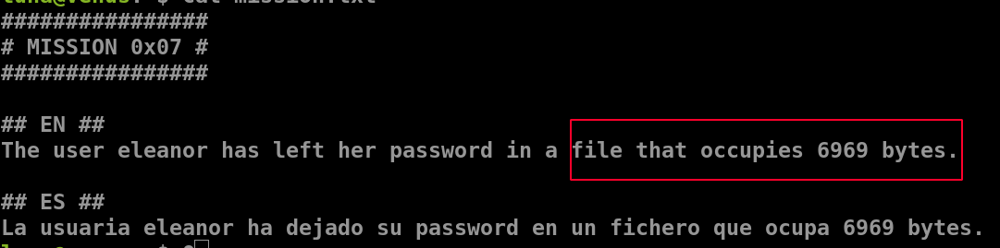
- `find / -type f -size 6969c 2>/dev/null`

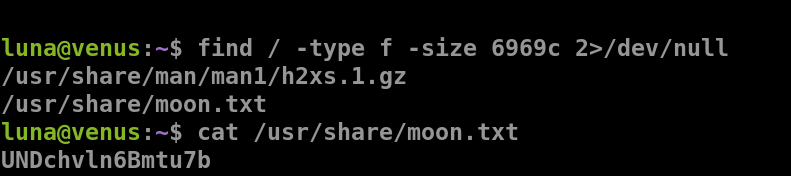

***

## Mission 8

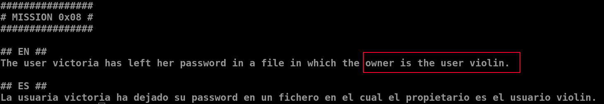
- `find / -type f -user violin 2>/dev/null`

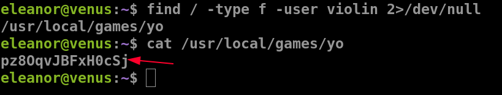
***
## Mission 9 

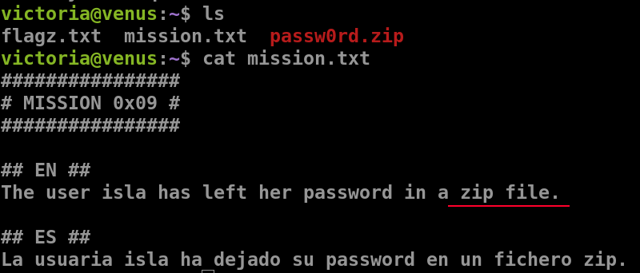
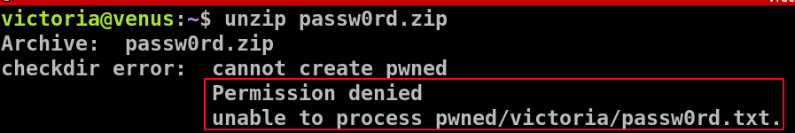
- since we dont have permissions,  we should create a directory in the `/tmp` directory
- `unzip passw0rd.zip -d /tmp/hj`
	- `-d` is used to mention an optional directory to which to extract files

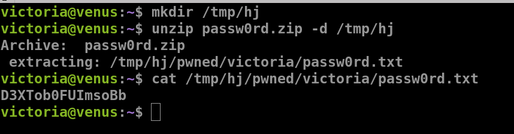

***

## Mission 10

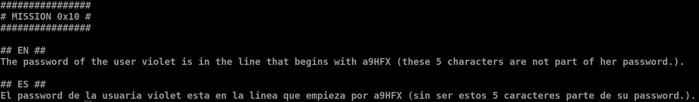
- `cat passy | grep -i "^a9HFX"`
	- `grep` is used to find strings in a text file
	- `-i` is used to match strings irrespective of the case(lower or upper)
	- `^` used to denote the start of the string

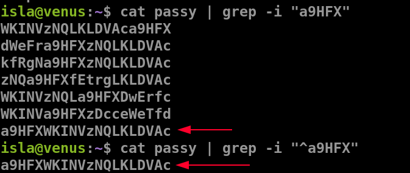

***

## Mission 11

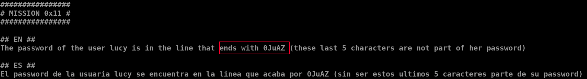
- `cat end | grep -i "0JuAZ$"`
	- `grep` is used to find strings in a text file
	- `-i` is used to match strings irrespective of the case(lower or upper)
	- `$` is used to denote the end of the string

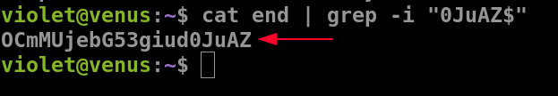

***
## Mission 12

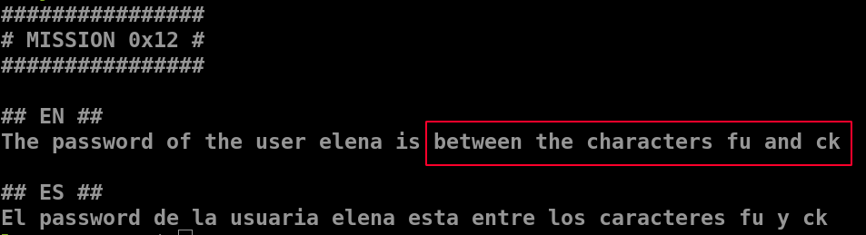
- `cat file.yo | grep "^fu.*ck$"`
	- `grep` is used to find strings in a text file
	- `$` is used to denote the end of the string
	- `^` used to denote the start of the string
	- `.*` denotes an arbitrary string of arbitrary length

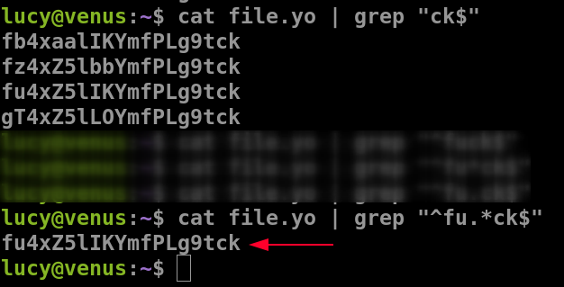

***

## Mission 13

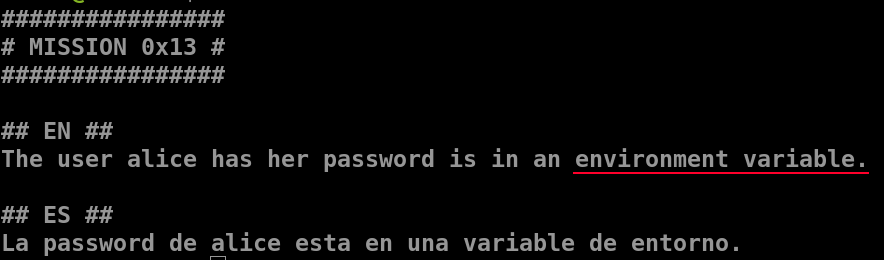
- `env`

***
